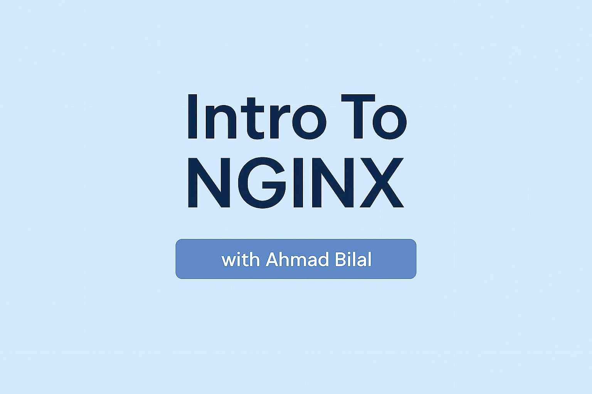

# 🌐 Introduction to NGINX: A Comprehensive Guide

Welcome to "Introduction to NGINX" - your comprehensive guide to mastering one of the most powerful and versatile web servers in the world! This course will take you from the basics to advanced configurations, helping you become proficient in using NGINX for various web infrastructure needs.

## 👨‍💻 Meet Your Instructor

Hello! I'm **Ahmad Bilal**, a Senior Full Stack Engineer with over 5 years of hands-on experience. I specialize in architecting and deploying secure, scalable backend systems and cloud infrastructure, with a strong focus on DevOps practices. My passion is helping engineers bridge the gap between theory and real-world application—so you can build systems that are robust, efficient, and ready for scale.

I'm excited to guide you through this course and share the insights, lessons, and best practices I've learned in the field. Let's level up your nginx skills together!

## 🎯 Target Audience

This course is designed for:
- Web developers and DevOps engineers
- System administrators
- Backend developers
- Anyone interested in learning about web servers and reverse proxies
- Professionals looking to enhance their infrastructure skills

## 🎓 What You'll Learn

By the end of this course, you will be able to:
- Understand NGINX's architecture and core concepts
- Configure NGINX as a web server and reverse proxy
- Implement load balancing and high availability
- Optimize performance with advanced configurations
- Deploy NGINX in Docker containers
- Handle WebSocket connections and real-time applications
- Implement security best practices
- Troubleshoot common issues

## 🧰 Prerequisites

To get the most out of this course, you should have:
- Basic understanding of web servers and HTTP protocol
- Familiarity with Linux command line
- Basic knowledge of networking concepts
- Docker fundamentals (for container-related chapters)

## 🧭 Course Structure

1. 🏗️ [NGINX Fundamentals and Architecture](./01-nginx-fundamentals.md)
2. 🐳 [Running NGINX in Docker](./02-nginx-docker.md)
3. ⏱️ [Understanding NGINX Timeouts](./03-nginx-timeouts.md)
4. ⚙️ [Advanced NGINX Configurations](./04-advanced-nginx.md)
5. 🔄 [Scaling WebSockets with NGINX](./05-websockets-nginx.md)
6. ❓ [Common Questions and Troubleshooting](./06-nginx-qa.md)
7. 🚀 [Advanced Techniques and Best Practices](./07-advanced-techniques.md)

## 📚 How to Use This Course

Each chapter is designed to be self-contained while building upon previous knowledge. Here's how to make the most of this course:

1. **Read Sequentially**: Start from Chapter 1 and progress through each chapter in order
2. **Practice Hands-on**: Try out the examples and configurations provided
3. **Review Questions**: Test your understanding with the questions at the end of each chapter
4. **Experiment**: Modify the examples to suit your specific use cases
5. **Use the Resources**: Refer to the additional resources provided in each chapter

## 🎯 Getting Started

To begin your NGINX journey, proceed to [Chapter 1: NGINX Fundamentals and Architecture](./01-nginx-fundamentals.md). You'll learn about NGINX's core concepts, architecture, and basic configurations.

---

➡️ [Next: NGINX Fundamentals and Architecture](./01-nginx-fundamentals.md) 